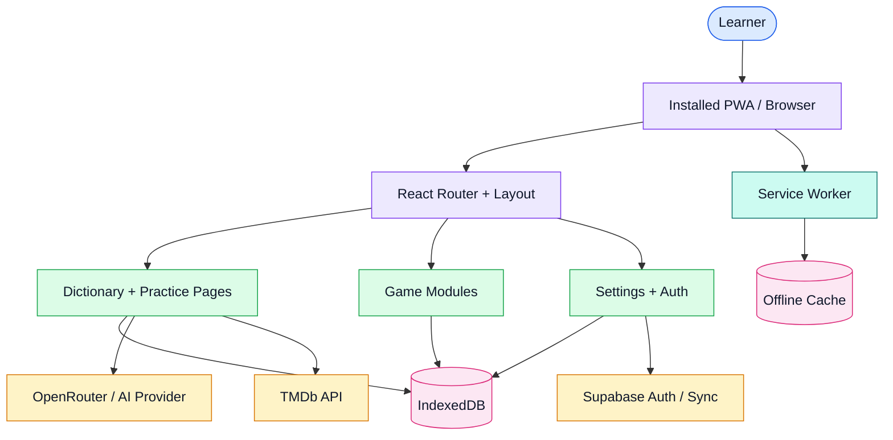

# LinguaLearn

[](https://react.dev/)
[](https://www.typescriptlang.org/)
[](https://vite.dev/)
[](https://web.dev/explore/progressive-web-apps)
[](https://developer.mozilla.org/en-US/docs/Web/API/IndexedDB_API)
[](https://vercel.com/)

LinguaLearn is an offline-capable language learning PWA with a personal dictionary, interactive vocabulary games, spaced practice flows, AI-assisted reading practice, and content recommendations for immersion.

Live demo: [lingua-learn.vercel.app](https://lingua-learn-mtluc4bao-brusnyaks-projects.vercel.app)

## Overview

LinguaLearn is built for lightweight daily practice. The app runs as a React PWA, stores learning data locally with IndexedDB, and can connect to external services for AI-generated practice content, movie and TV recommendations, and optional cloud authentication or sync.

The project focuses on:

- Personal vocabulary collection and review.
- Game-based practice sessions.
- Offline-first usage through PWA support.
- Progress and mastery tracking.
- AI-assisted story and reading practice.
- Import workflows for CSV and Excel vocabulary lists.

## Features

| Feature | Details |
| --- | --- |
| Dictionary management | Add, organize, import, and review words or phrases. |
| Vocabulary games | Vocab Dungeon, flashcards, word match, word builder, real-world practice, and listening challenge routes. |
| Mastery tracking | Tracks learning progress, mastered words, and practice history. |
| Reading practice | Generates or presents reading material for contextual vocabulary practice. |
| Content suggestions | Uses TMDb data to recommend movies and TV shows in the target language. |
| Offline support | Uses service workers and IndexedDB for installable PWA behavior. |
| Customizable UI | Supports themes, fonts, text sizing, motion, and interaction feedback. |
| Cloud-ready auth | Includes optional Supabase-backed authentication and sync paths. |

## System design



### Runtime flow

| Step | Component | Responsibility |
| --- | --- | --- |
| 1 | PWA shell | Loads the React application and registers the service worker. |
| 2 | Router and layout | Directs users to dictionary, games, settings, reading, and statistics pages. |
| 3 | Local database | Seeds starter content and persists vocabulary, settings, progress, and game state. |
| 4 | Practice modules | Run flashcards, matching, dungeon, listening, reading, and word-building flows. |
| 5 | External APIs | Provide AI-generated content, media recommendations, and optional cloud auth or sync. |
| 6 | Deployment layer | Builds with Vite and deploys as a static web app. |

## Tech stack

| Layer | Choice | Notes |
| --- | --- | --- |
| Frontend | React 19 + TypeScript | Main application UI and route-based experience. |
| Build tool | Vite 6 | Development server and production build pipeline. |
| Routing | React Router | Page routing for games, dictionary, onboarding, and settings. |
| Local storage | IndexedDB via `idb` | Offline-first persistence for learning data. |
| Animation | Framer Motion | UI transitions and interaction polish. |
| Styling utilities | Tailwind CSS, `clsx`, `tailwind-merge` | Themeable and composable UI styling. |
| PWA | `vite-plugin-pwa`, service worker | Installable app behavior and offline support. |
| Cloud/auth option | Supabase | Optional authentication and sync path. |
| External content | TMDb API | Movie and TV recommendations. |
| AI content | OpenRouter-compatible key in `.env.example` | AI-assisted story or practice content. |
| Import support | `xlsx` | Spreadsheet-based vocabulary import. |

## Application areas

| Area | Route examples | Purpose |
| --- | --- | --- |
| Home | `/` | Main dashboard and entry point. |
| Dictionary | `/dictionary`, `/dictionary/:id`, `/word/:id` | Vocabulary management and word detail views. |
| Games | `/games`, `/games/dungeon`, `/games/flashcards`, `/games/word-match`, `/games/word-builder` | Interactive practice flows. |
| Reading | `/reading`, `/reading/:storyId` | Story-based contextual practice. |
| Progress | `/statistics`, `/mastered` | Learning statistics and mastered vocabulary. |
| Onboarding/auth | `/login`, `/onboarding`, `/auth/callback` | User setup and authentication. |
| Settings | `/settings` | Preferences and app configuration. |

## Quick start

Install Node.js 18 or newer, then clone and install dependencies:

```bash
git clone https://github.com/brusnyak/LinguaLearn.git
cd LinguaLearn
npm install
```

Create a local environment file:

```bash
cp .env.example .env
```

Start the development server:

```bash
npm run dev
```

Build and preview production output:

```bash
npm run build
npm run preview
```

## Environment variables

| Variable | Required | Description |
| --- | --- | --- |
| `VITE_OPENROUTER_API_KEY` | Optional | Enables AI-assisted language practice features. |
| `VITE_TMDB_API_KEY` | Optional | Enables movie and TV recommendation features. |
| `VITE_SUPABASE_URL` | Optional | Supabase project URL for cloud auth or sync. |
| `VITE_SUPABASE_ANON_KEY` | Optional | Supabase anonymous key for client-side auth. |
| `VITE_PB_URL` | Optional | Alternative PocketBase URL if using a self-hosted backend path. |
| `GITHUB_CLIENT_ID` | Optional | GitHub OAuth client ID for Supabase provider setup. |
| `GITHUB_CLIENT_SECRET` | Optional | GitHub OAuth client secret for provider setup. |
| `SUPABASE_PAT` | Optional | Supabase management token for project setup workflows. |

## Scripts

| Command | Purpose |
| --- | --- |
| `npm run dev` | Start the Vite development server. |
| `npm run build` | Type-check and build the production app. |
| `npm run lint` | Run ESLint checks. |
| `npm run preview` | Preview the production build locally. |

## Deployment

### Vercel

1. Import the repository into Vercel.
2. Set the required environment variables in the Vercel dashboard.
3. Deploy with the default Vite settings.

### Netlify or static hosting

Build the app and deploy the generated `dist` directory:

```bash
npm run build
```

## README style direction

This repository follows the shared portfolio README structure:

- Short product description at the top.
- Technology labels for fast scanning.
- Feature and route tables for structured reading.
- Coloured system design diagram when architecture is useful.
- Practical setup, configuration, script, and deployment sections.

## License

MIT

## Acknowledgments

- Movie and TV metadata provided by [TMDb](https://www.themoviedb.org/).
- Icons provided by [Lucide](https://lucide.dev/).
